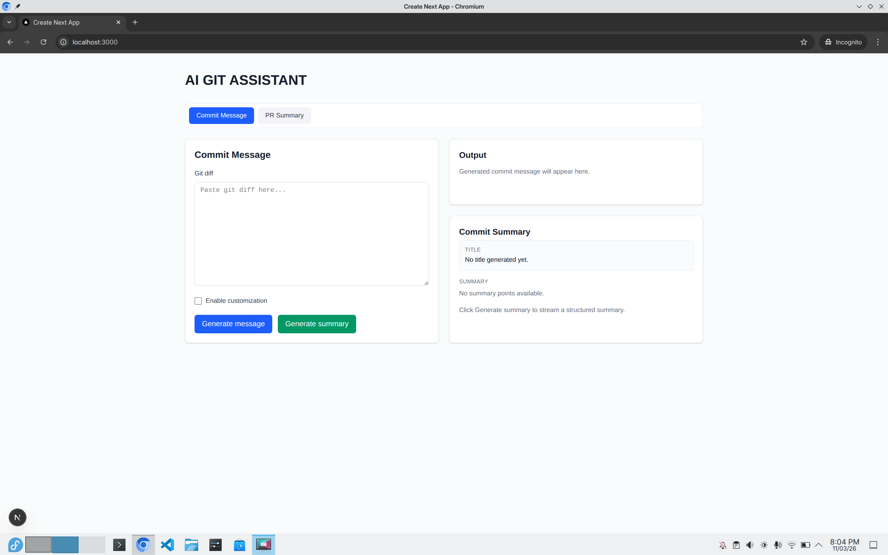
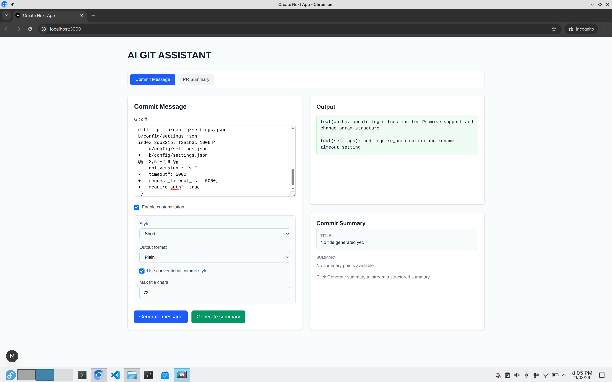
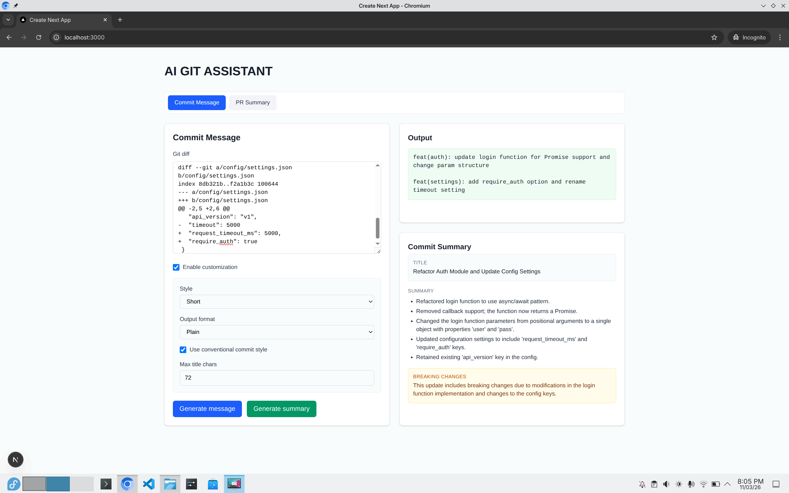
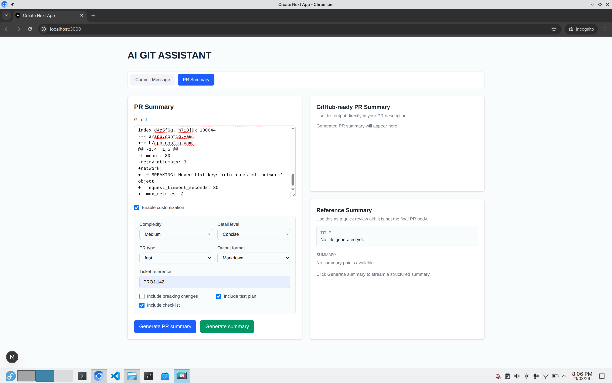
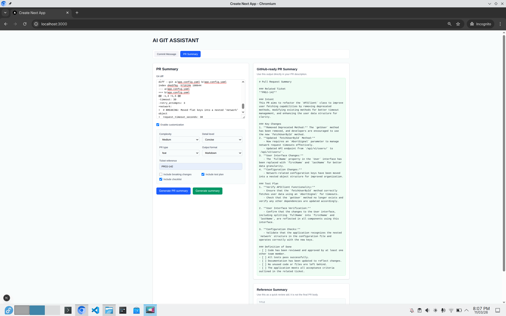
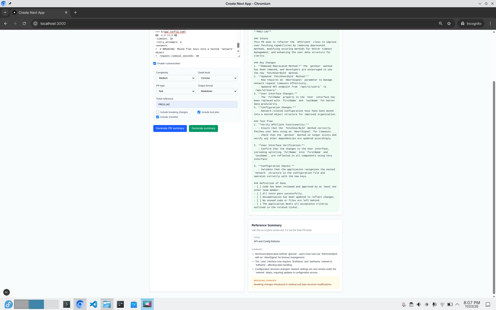

# AI Git Assistant

This is a small project where I was playing with Vercel AI SDK and Generative UI patterns.

The idea was simple: paste a git diff, then generate useful writing artifacts for development workflows.

## What It Does

- Generate commit messages from git diffs.
- Generate PR summaries that are ready to paste into GitHub.
- Stream a structured "reference summary" (title, points, breaking changes) as Generative UI.
- Offer optional customization controls (style, format, detail level, checklist/test-plan toggles).

## Stack

- Next.js
- Vercel AI SDK
- React + React Hook Form + Zod

## Screenshots

